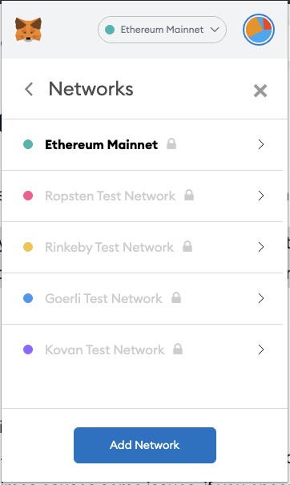

---
meta:
  - name: "title"
    content: Connecting MetaMask to Astra Network
  - name: "description"
    content: Ethereum’s most iconic wallet, MetaMask, can be easily tweaked to support Astra Network.
  - name: "og:title"
    content: Connecting MetaMask to Astra Network
  - name: "og:type"
    content: Website
  - name: "og:description"
    content: Ethereum’s most iconic wallet, MetaMask, can be easily tweaked to support Astra Network.
  - name: "og:image"
    content: https://astraprotocol.github.io/docs/preview.png
  - name: "twitter:title"
    content: Connecting MetaMask to Astra Network
  - name: "twitter:site"
    content: "@AstraProtocol"
  - name: "twitter:card"
    content: summary_large_image
  - name: "twitter:description"
    content: Ethereum’s most iconic wallet, MetaMask, can be easily tweaked to support Astra Network.
  - name: "twitter:image"
    content: https://astraprotocol.github.io/docs/preview.png
canonicalUrl: https://astraprotocol.github.io/docs/getting-started/metamask.html
---


# Connecting MetaMask to Astra Protocol
In the following step-by-step guide, you will learn how to use the MetaMask chrome extension to send/receive and interact with the Astra chain.

## Installing and setting up MetaMask
MetaMask can be downloaded on Chrome and Firefox, or on iOS and Android if you’re a mobile user. 

Firstly, you’ll want to head over to the MetaMask [Download page](https://metamask.io/download.html). From there, select whichever platform you’re using, and follow the steps to install it on your device. Easy!

Next, follow along with the setup specified by the app. Go ahead and click Create a Wallet. Write down the backup [seed phrase](https://academy.binance.com/en/glossary/seed-phrase) somewhere secret (preferably not on an Internet-connected device). Without this phrase, your funds can’t be recovered if your device is damaged or lost. Confirm that you’ve written them down on the next page.

And that’s it! You should now see your wallet, ready to send and receive funds.
<p align="center">
  
  <h4 align = "center"><i>The freshly-initialized MetaMask wallet.</i></h4>
</p>

## Configuring the wallet
Let’s set up!

* Hit the my account button in the top right corner, under <b>"Settings"</b>, select <b>"Networks"</b>
<p align="center">
  
  <h4 align = "center"><i>Select Settings from the dropdown menu.</i></h4>
</p>

* On the Settings page, we want to locate the Networks menu, then click <b>"Add Network"</b>.
<p align="center">
  
  <h4 align = "center"><i>The Networks menu.</i></h4>
</p>
<h4 align = "center"><i>or</i></h4>
<p align="center">
  
  <h4 align = "center"><i>The Networks menu.</i></h4>
</p>
<p align="center">
  
  <h4 align = "center"><i>Add Network</i></h4>
</p>

## Insert the network information

### Testnet

<b>Network Name:</b> Astra Testnet <br />
<b>New RPC URL:</b> [https://rpc.astranaut.dev/](https://rpc.astranaut.dev/) <br />
<b>ChainID:</b> 11115 <br />
<b>Symbol:</b> ASA <br />
<b>Block Explorer URL:</b> [https://explorer.astranaut.dev/](https://explorer.astranaut.dev/) <br />


<h4 align = "center"><i>Network Info</i></h4>

After saving the network config, we should be able to see the token in your address!
<p align="center">
  
  <h4 align = "center"><i>Result</i></h4>
</p>

## Address conventions
Note that the address format in **Astra** is in there form of bech32 ```astra...```

You can convert your address from ETH to Astra and vice versa at [here](https://astra-utilities.vercel.app/)


## Astra Faucet
Get testnet token at [here](https://faucet.astranaut.dev/)


## Astra Explorer
After creating a smart contract or interacting with it, you can go [here](https://explorer.astranaut.dev/) and find some helpful information (like etherscan, bscscan…)

